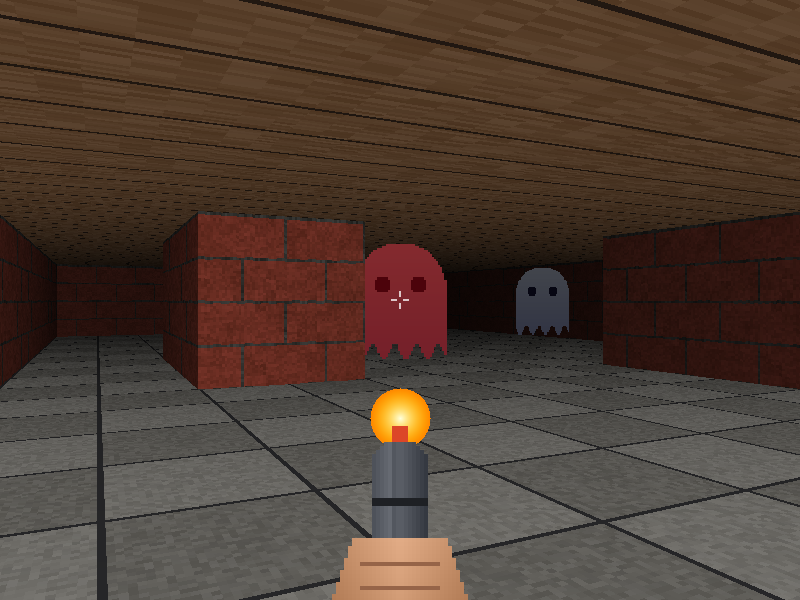

# Maze Game

A first-person 3D maze in the style of Wolfenstein 3D, built in C on SDL2 with a raycasting engine
written from scratch. Every pixel of the scene is computed by the program and pushed to the screen
as one streaming texture; SDL is used only for the window, input and the final blit.



## Features

- **Raycasting engine** — DDA grid traversal, perpendicular distances (no fish-eye)
- **Textured walls**, with north/south faces shaded apart from east/west
- **Textured floor and ceiling** via per-row floor casting
- **Distance fog** — corridors fade into shadow
- **Enemy sprites** that chase the player within sight, slide along walls, and are hidden correctly
  behind walls by a per-column depth buffer
- **Shooting** — hitscan down the crosshair against the same depth buffer, so walls stop bullets;
  three hits flash a ghost red and shrink it away, and the window title counts the ghosts left
- **Muzzle flash and recoil** on every shot, with a fire-rate cooldown
- **Collision detection** with a player radius, sliding along walls instead of sticking
- **Minimap** with walls, enemies, the player and their facing
- **Rain** with wind and a cold tint, toggled at runtime
- **Weapon** with a walking bob
- **Frame-rate independent** movement (speeds are per second, not per frame)
- Textures are generated at startup, so the game runs from a fresh clone; drop BMPs into
  `textures/` to replace any of them

## Controls

| Key | Action |
|---|---|
| W / S or ↑ / ↓ | Move forward / backward |
| A / D | Strafe left / right |
| ← / → | Turn |
| Space or left click | Shoot |
| M | Toggle minimap |
| R | Toggle rain |
| Esc | Quit |

## Building

**Linux**

```bash
sudo apt-get install build-essential libsdl2-dev
git clone https://github.com/MohamedSaad00/Maze-Game.git
cd Maze-Game
make
```

**Windows (MinGW-w64)** — download `SDL2-devel-<version>-mingw.zip` from the
[SDL releases](https://github.com/libsdl-org/SDL/releases), then point the build at it:

```bash
make SDL2_CFLAGS="-IC:/SDL2/x86_64-w64-mingw32/include -Dmain=SDL_main" \
     SDL2_LIBS="-LC:/SDL2/x86_64-w64-mingw32/lib -lmingw32 -lSDL2main -lSDL2"
```

and keep `SDL2.dll` next to `maze_game.exe`.

## Running

```bash
./maze_game maps/sample.map     # the full maze
./maze_game maps/arena.map      # a small room with enemies in view
```

`--screenshot <file.bmp>` renders a single frame (minimap and rain on) to a file and exits:

```bash
./maze_game maps/sample.map --screenshot shot.bmp
```

## Map format

A plain text grid, one row per line:

| Character | Meaning |
|---|---|
| `1` | Wall |
| `0` or space | Floor |
| `2` | Enemy spawn |
| `P` | Player start, facing east (optional; defaults to the first open cell) |

Rows may differ in length; short rows are padded with walls, and the outer border is always solid,
so neither a ray nor the player can leave the map. Unknown characters are reported with their row
and column.

## Textures

Optional 64×64-sampled BMPs in `textures/`: `wall.bmp`, `floor.bmp`, `ceiling.bmp`, `enemy.bmp`,
`weapon.bmp`. In `enemy.bmp` and `weapon.bmp`, magenta (`#FF00FF`) is transparent. Any file that is
missing is generated instead.

## Project structure

```
Maze-Game/
├── inc/
│   └── maze.h        shared types, constants and prototypes
├── src/
│   ├── main.c        arguments, main loop, delta time, key toggles
│   ├── game.c        SDL setup, movement, frame composition, screenshot, cleanup
│   ├── raycast.c     wall casting (DDA), floor/ceiling casting, distance shading
│   ├── map.c         map parsing and validation, collision, minimap
│   ├── texture.c     procedural textures and optional BMP loading
│   └── effects.c     enemies (sprites, chase, hits), shooting, weapon, rain
├── maps/
│   ├── sample.map    25×19 maze, six enemies
│   └── arena.map     small room for a quick look
├── docs/
│   └── screenshot.png
├── Makefile
└── README.md
```

## License

MIT — see [LICENSE](LICENSE).
